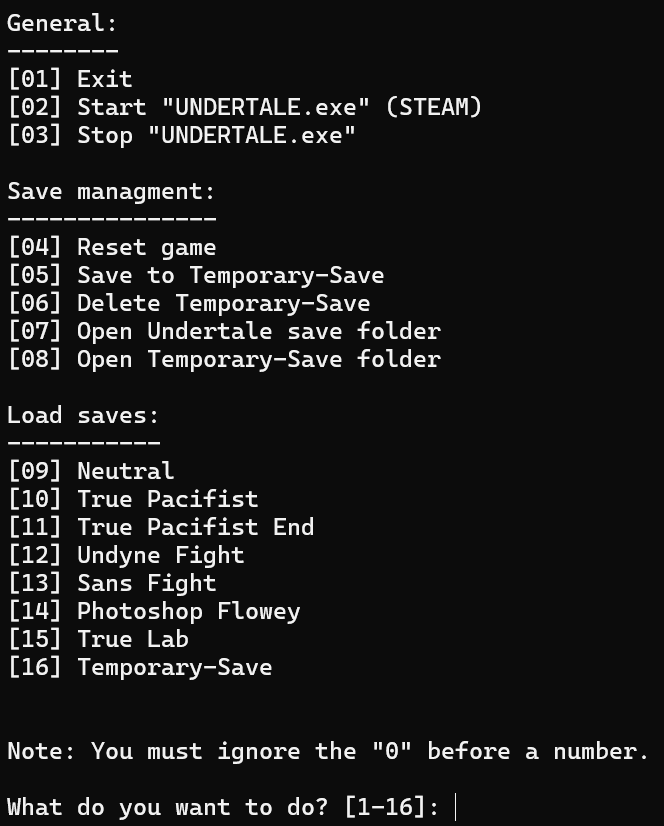

# UndertaleCFG

A small command-line save file manager for **Undertale**.

UndertaleCFG is a personal side project that makes it easier to switch between predefined save states without manually copying files around.

There are probably more advanced tools out there, but this one focuses on being lightweight and straightforward.

---

## Preview

### Main Menu

The interface is entirely CMD-based and menu-driven.

---

## What It Does

UndertaleCFG allows you to:

### Game Control
- Start Undertale (Steam version)
- Stop Undertale
- Reset the current save

### Save Management
- Load preconfigured save states
- Create and load a **Temporary-Save**
- Delete the Temporary-Save
- Open the Undertale save folder
- Open the Temporary-Save folder

---

## Important: How Saves Work

All route saves are **preconfigured and fixed**.

They cannot be modified through the program.

Available presets include:

- Neutral
- True Pacifist
- True Pacifist End
- Undyne Fight
- Sans Fight
- Photoshop Flowey
- True Lab

The only editable slot is:

- **Temporary-Save**

You can:
- Save your current progress into Temporary-Save
- Load it later
- Delete it when no longer needed

This makes it useful for practicing fights or testing scenarios without affecting the predefined saves.

---

## Installation

The newest release includes a **setup file** for easy installation.

The installer will:
- Copy the required files
- Create a Start Menu shortcut
- Create a Desktop shortcut

After installation, you can launch it like any other program.

If you prefer, you can also download the `.zip` file and install it manually.

---

## Why I Made This

I wanted a quick way to jump between specific points in the game (especially boss fights) without manually replacing save files every time.

This project started as a small utility for personal use and gradually became more structured. It’s not meant to replace full-featured save editors — just a simple, focused tool.

---

## Technical Notes

- Written in Batch / CMD
- Windows only
- Designed for the Steam version of Undertale
- No external dependencies

---

## License

This project is licensed under the **MIT License**.  
See the [LICENSE](LICENSE) file for more information.
